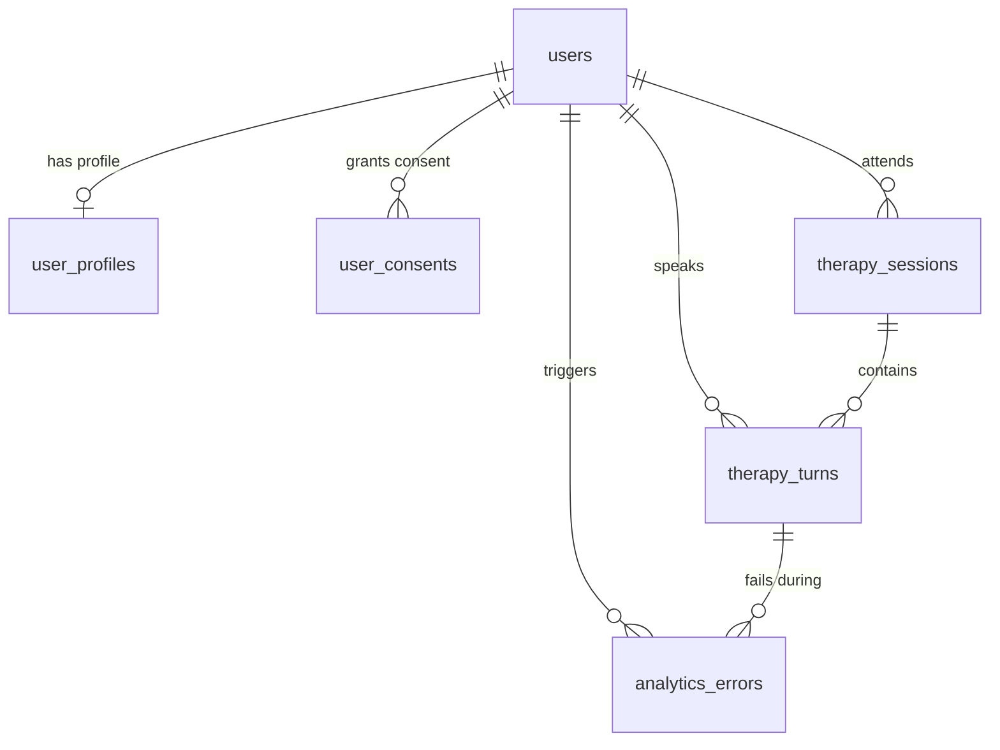

# Adio Database Schema & Architecture Summary

This document explains the architecture of the **Adio Database Schema**, which has been fully migrated from a monolithic JSON-based storage model to a normalized, production-grade relational database design inside Supabase.

---

## 1. What This Visualization Means

The schema visualization shows a **relational, database-first design** built for secure, highly granular therapy tracking and COPPA compliance. 

### Transition from Old to New
At the very top of the diagram, you can see the old model (`sessions` table), which stored session metadata and questions in a single flat array: `qa_history (jsonb)`. 
*   **The Problem:** Storing speech interactions as raw JSON arrays made it impossible to query statistics easily (e.g. "What is the child's average response latency?" or "Which structure words does the child struggle with most?").
*   **The Solution:** We broke this monolithic structure down into normalized tables with strict relationships, using `auth.users.id` as the root of security.

---

## 2. Core Tables and Relationships

The database is built around **5 primary tables** inside the `public` schema, mapped to Supabase's built-in `auth` engine:

### 1. `user_profiles` (Onboarding & PII Separation)
*   **Purpose:** Stores child and guardian demographics collected during onboarding.
*   **Primary Key:** `id (uuid)` which references `auth.users.id` directly.
*   **Why this is constructed this way:** By mapping the profile ID directly to the user ID, we enforce a strict 1-to-1 relationship. PII (names, nickname, grade) is isolated here, keeping it completely separated from anonymous analytical event logging.

### 2. `user_consents` (COPPA Compliance)
*   **Purpose:** Tracks parental consent status and agreement version for speech data collection.
*   **Fields:** `id`, `user_id` (foreign key), `consent_type`, `granted (boolean)`, `version`, `created_at`.
*   **Why this is constructed this way:** Provides a legally verifiable audit trail of when and how consent was granted by the guardian.

### 3. `therapy_sessions` (Aggregate Session Analytics)
*   **Purpose:** Represents a single therapy session (where a child looks at a specific image and answers questions).
*   **Metrics Tracked:** Calculates overall clinical outcomes like `observation_score`, `understanding_score`, `engagement_score`, and `avg_latency_ms`.
*   **Relationships:** Tracks which user owns it (`user_id` -> `auth.users.id`) and logs the active visual stimulus (`image_id`, `image_filename`, `image_complexity`).

### 4. `therapy_turns` (Granular Interaction Data - The Core Table)
*   **Purpose:** Every single question/answer event (each "turn") gets its own dedicated row.
*   **Audio Recording Meta:** Tracks `audio_storage_path` (pointing to the private Supabase Storage bucket), `audio_duration_ms`, `audio_size_bytes`, and the time the mic started and stopped recording.
*   **Diagnostics:** 
    *   `initiation_latency_ms`: Time in milliseconds it took the child to start speaking after the question appeared (the key neurological metric).
    *   `asr_mode` & `asr_latency_ms`: Evaluates the transcription performance.
    *   `llm_model`, `llm_latency_ms`, `llm_evaluation`, `llm_followup`: Full telemetry of the AI evaluator's thinking and response.
    *   `scores`: Sub-scores (accuracy, clarity, detail, relevance) in a structured `jsonb` format.
*   **Relationships:** Linked directly to a parent session (`session_id` -> `therapy_sessions.id`) and the user who spoke (`user_id`).

### 5. `analytics_errors` (Reliability Tracking)
*   **Purpose:** Standardized error logging for ASR, LLM, or storage failures.
*   **Fields:** `id`, `user_id`, `session_id`, `turn_id` (all fully linked so you can trace a bug back to a specific session and spoken turn), `area` (e.g. 'auth', 'processing'), `error_code`, `error_message`, and `context (jsonb)`.

---

## 3. How We Built It

We implemented this architecture by executing a systematic 3-part plan:

1.  **Strict Database Normalization:** We constructed the SQL DDL (`web/supabase/migrations/001_instrumentation.sql`) utilizing foreign key constraints with `ON DELETE CASCADE` so that if a user deletes their account, all their sensitive profiles, sessions, turns, and consents are instantly and cleanly deleted from the database in compliance with privacy guidelines.
2.  **Row-Level Security (RLS):** Enabled RLS on every table to restrict access:
    *   Users can *only* read or write their own profile (`auth.uid() = id`).
    *   Users can *only* read their own sessions and turns (`auth.uid() = user_id`).
3.  **Backend Controller Layer:** We built the Python service `services/interaction_store.py` which intercepts the client requests, validates their JWT identity token securely on the server, uploads the raw audio to the private Supabase Storage bucket (`therapy-audio`), and handles the multi-step transaction process to save turns and calculate session averages.
